# Chapter 1 - Initial Setup

This tutorial will take you through building a third person shooter game using the Bolt Networking Engine. The game
we are building will feature several complex features which allows us to go through most of what Bolt can do.

 * Authoritative movement, shooting and game logic
 * Replication of animation, transforms and game object state
 * ... **ADD MORE**

## Art

All of the art we are using in this tutorial has either been produced with, provided by or run through the excellent [PolyWorld: Woodland Toolkit](https://www.assetstore.unity3d.com/en/#!/content/18572).

## Getting Bolt

If you purchased Bolt through the Unity Asset Store, the best way to get the latest version of Bolt is by going to [http://www.boltengine.com/AssetStore.aspx](http://www.boltengine.com/AssetStore.aspx) and punching in your asset store invoice number, this lets you always access the latest version of Bolt without having to wait for the Asset Store update to process.

If you purchased Bolt through our site, you should have been supplied a download link on the return page after your purchase, if you have for some reason lost this link, email [support@boltengine.com](support@boltengine.com) to receive a new one. We also send out a link for every release of Bolt to your email. 

## Basic settings and development features

Extract the downloaded *Bolt\_VERSION.zip* package to a folder somewhere on your disk and find the .unitypackage file called *Bolt\_VERSION_Tutorial.unitypackage*. Create a new unity project and import the package, this will leave you with a directory structure like the image below.

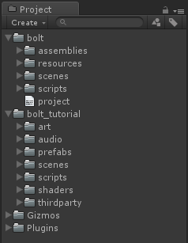

This package contains an already unpacked and installed version of Bolt, complete with a working version of the entire tutorial in the *bolt\_tutorial* folder. Before we get started with the tutorial, open up the *Bolt Settings* window which you can find at *Window/Bolt Settings* in the top menu.

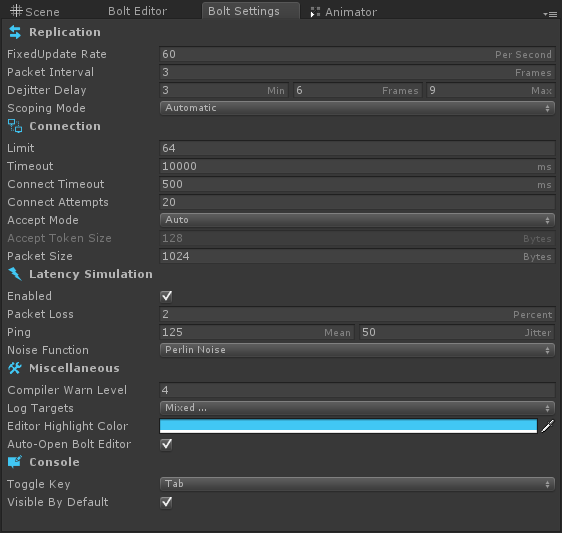

Most of the settings here we can ignore for now, but look at the bottom *Console* settings and make sure that *Toggle Key* is set to something easily accessible for you, and also that *Visible By Default* is checked. This tells Bolt to always create an in-game console for you when it starts so that we have an easy way to get information from Bolt.   

Create a new folder in the root of your project, I will be calling my folder *tutorial* throughout this tutorial. Create the following folders inside of your new folder.

* Scripts
* Scenes

Your folder structure should look like this.
 
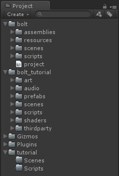

Inside the *bolt\_tutorial/scenes* folder there is a preexisting level we are going to use, you are free to make your own before we continue. If you chose to use our level, copy the scene at *bolt\_tutorial/scenes/Level1.unity* into your own *tutorial/Scenes* folder and rename it *Level2.unity*. Our level looks like this.

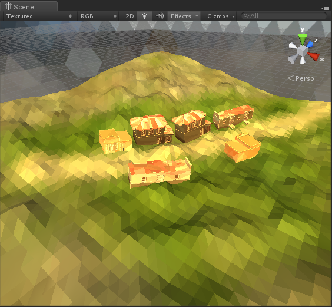

We also need a *MainMenu* scene so that we have an easy way of starting our game while developing it; Bolt comes with a simple script which helps us do this. Create a new scene; on the Main Camera in the empty scene attach the script found in *bolt/scripts/BoltInit.cs*, save this scene to *tutorial/Scenes/MainMenu.unity*

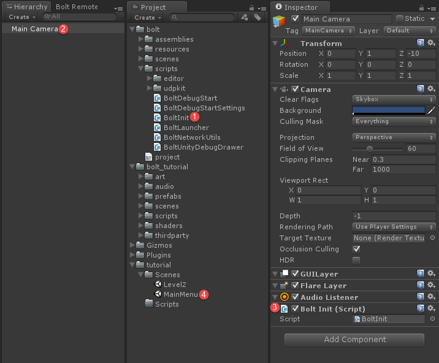

Above is the *BoltInit* script attached to the main camera in the *ManuMenu* scene. Below is how your *tutorial* folder should look like.

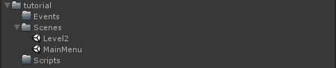

Before we launch our scene, to make sure everything is working, we need to setup a few things inside Unity, first we have to add both our *MainMenu* and *Level2* scene to the Build Settings. Make sure that *MainMenu* comes before *Level2*.

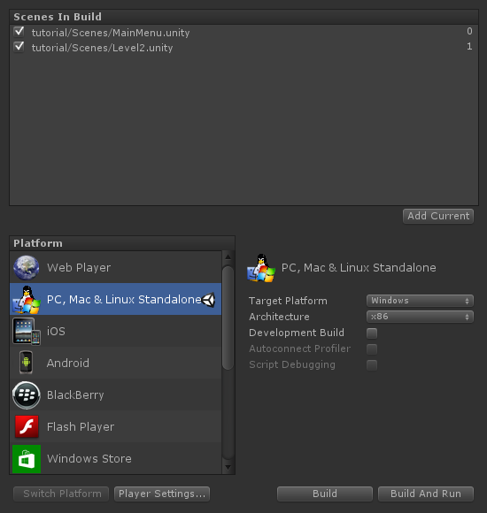

Click the *Player Settings...* button in the *Build Settings* window. Under *Settings for PC, Mac & Linux Standalone* verify that you have the following settings correct.

1. Default Is Full Screen - **DISABLED**  
2. Default Screen Width - **640**
3. Default Screen Height - **360**
4. Run In Background - **ENABLED**
5. Display Resolution Dialog - **DISABLED**

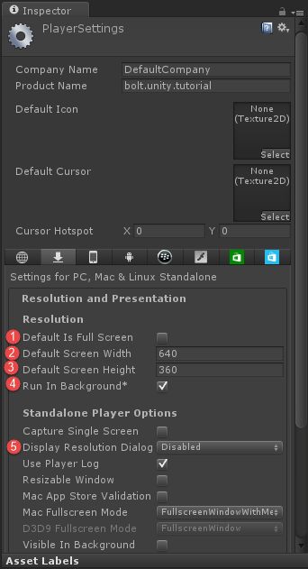 

You can obviously pick whatever width/height you want, but I find that if you want to run a couple of clients at the same time 640:360 is a good resolution. If you build a standalone version of your project and start two copies of it, you will be greeted by the following screen.

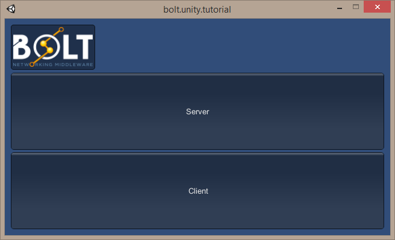

Start one of the instances as *Server* and the other as *Client*, when you click server you get to pick a map to load, and since we only have one *Level2* pick that. On the *Client* you get to input an IP and Port, but the default should be fine so just click *Connect*. On each of the instances you will see a screen that looks like this.

Since we don't have a camera inside our *Level2* scene, all we get is the blue background from the previous scene. Let's look at another way to start our game, which is especially handy when we need to do quick testing.

Open up the *Bolt Scenes* window by going to *Windows/Bolt Scenes*, it will look something like this.

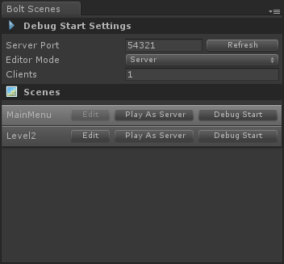

This window looks a bit different depending on if you have Unity Pro or not, the window in the screenshot above is the version in Unity Pro, and if you have Unity Free you will not see the *Debug Start Settings* options or the *Debug Start* button. 

*Debug Start* allows you to tell Bolt to start a server + N clients, and then have them all connect to each other and load the correct scene, without manually doing anything. To learn more about it watch this video.

The button we are going to look at right now is the *Play As Server* button, this button is available for both Unity Pro and Unity Free users and simply starts the scene you click on as a Bolt server, and since it's easy to setup your game with Bolt so that you can switch between dedicated or listen servers, this gives a quick and easy way of testing features when developing, below you can see the server running inside of the editor after pressing *Play As Server*.  

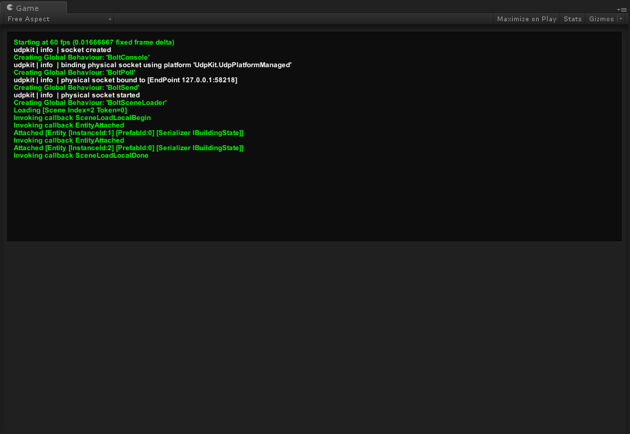

## Setting up our Layers

One last thing we need to do before we continue is to setup the correct Layers which we will be using later on. Open up the *Edit/Project Settings/Tags and Layers* settings. Make sure your layer settings match the following ones:

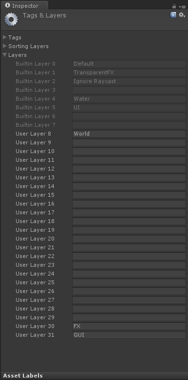

## Playing the finished game

If you want to play the finished game that we are going to build in the tutorial add the scene found in *bolt_tutorial/scenes* called *Level1* to your *Build Settings*, it will then show up in the *Bolt Scenes* window like this.

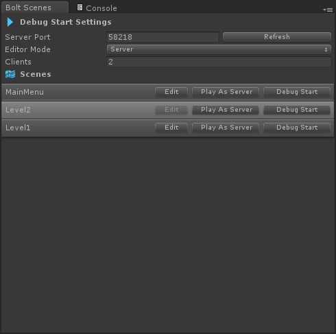

You can now start this level as you wish, run around and test out all the features of the game, etc. That was all for this chapter, in the next one we will start developing code for our game.

[Next Chapter >>](chapter2.md)
