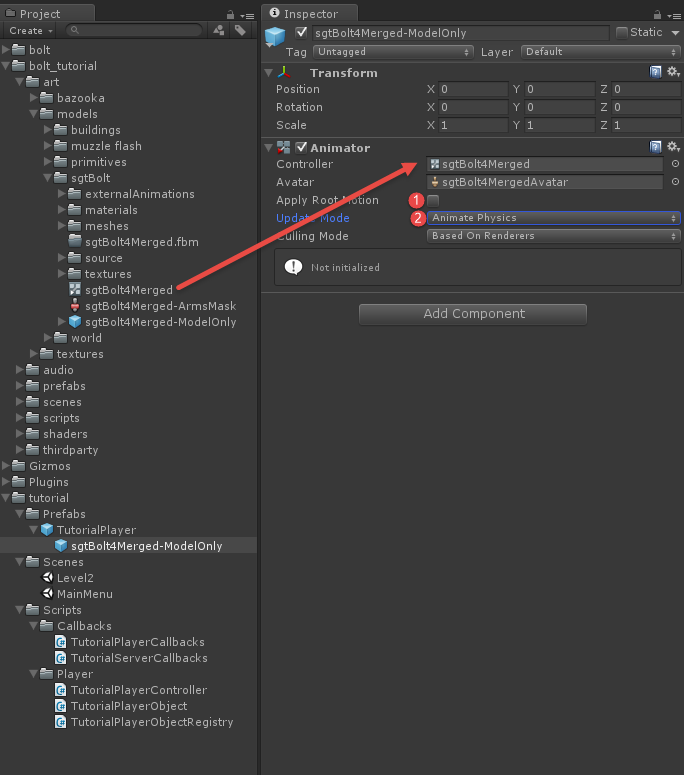
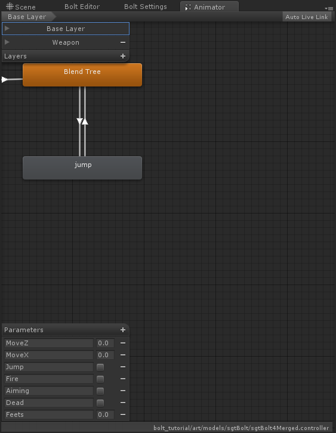
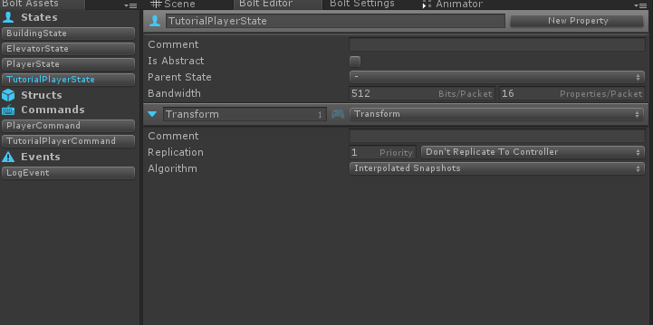
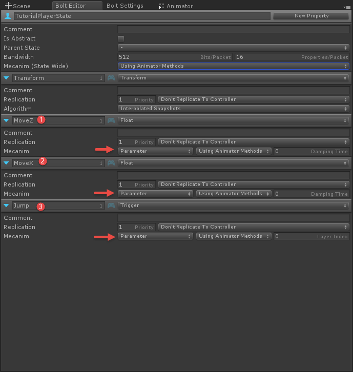
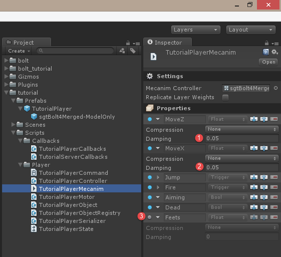

[<< Prev Chapter](chapter3.md)

# Animations (Mecanim)

In this chapter we will explain how to replicate animations over the networking using Bolt. There are many ways to do this, even many ways inside Bolt, we are going to look at the *default* way of replicating mecanim parameter state over the network. This chapter will be rather short, as there is not that much to write about mecanim replication, but it's such an important topic that it deserves its own chapter.

## Creating a mecanim asset

The first thing we are going to do is to hook up the *Animator Controller* for the character we are using, you can find the controller in *bolt_tutorial/art/models/sgtBolt/sgtBolt4merged*. Drag it into the *Controller* slot on the *sgtBolt4Merged-ModelOnly* sub-object on your *TutorialPlayer* prefab. Also do the following settings:

1. Disable *Root Motion*
2. Set *Update Mode* to *Animate Physics*

 

When the animator controller is connected, open it up on the unity animator editor.

 

Here you can see the parameters available, for now we are only going to use MoveZ, MoveX and Jump. MoveZ and MoveX are floats and Jump is a trigger. Go to the *Window/Bolt Engine/Assets* window and open up the *TutorialPlayerState* we created earlier.



We are going to define three new properties here, called the same thing as the three ones from the mecanim animator we are using.

* MoveX, Float
* MoveZ, Float
* Jump, Trigger

In the settings for each property, switch the mecanim setting from *Disabled* to *Parameter*. 



There is one more option we need configure, to the right of the *Disabled/Parameter/Layer Weight* selector for mecanim you also have the option of selecting between *Use Animator Methods* and *Use Bolt Properties*. 

* **Use Animator Methods** means that you want to use the normal SetFloat, SetInteger, etc. methods of mecanim and have Bolt automatically pull the value out. 
* **Use Bolt Parameters** means that you want to use the Bolt parameters to set the mecanim values and have Bolt apply them to mecanim for you.

You can also configure this state wide at the top in the state specific settings. We are going to select *Use Bolt Properties* on MoveZ, MoveX and Jump.

We are almost done, it's time to compile Bolt again, go to *Assets/Compile Bolt Assets (All)* and let Bolt do it's thing. Now open up the *TutorialPlayerController.cs* script.

We are going to add a new method called *AnimatePlayer*, its pretty much standard mecanim code where we set a MoveZ parameter to -1 or +1 depending on if we are moving forward/backward and the same with MoveX for left/right. 

```csharp
  void AnimatePlayer(TutorialPlayerCommand cmd) {
    using (var stateModify = state.Modify()) {
      // FWD <> BWD movement
      if (cmd.Input.Forward ^ cmd.Input.Backward) {
        stateModify.MoveZ = cmd.Input.Forward ? 1 : -1;
      }
      else {
        stateModify.MoveZ = 0;
      }

      // LEFT <> RIGHT movement
      if (cmd.Input.Left ^ cmd.Input.Right) {
        stateModify.MoveX = cmd.Input.Right ? 1 : -1;
      }
      else {
        stateModify.MoveX = 0;
      }

      // JUMP
      if (_motor.jumpStartedThisFrame) {
        stateModify.Jump();
      }
    }
  }
```

One thing to notice here is that to modify the state of an entity we call the Modify() method and use the returned object for modifying the properties, if you try to set a property directly on the state the code will not compile as there are no setters defined directly on the state. The reasons for this are:

1. It makes editing the state very explicit and you will not accidentally change the state by mistake
2. We can detect if the current computer running has access to change the state in one location.
3. In the future you will be able to call modify with different arguments changing it behavior.

Inside of the `ExecuteCommand` function we are going to call our new `AnimatePlayer` function, we are going to access a very specific property on our command called `IsFirstExecution`. If this is true that means that this is the first time this command is being executed.

```csharp
  public override void ExecuteCommand(Bolt.Command command, bool resetState) {
    TutorialPlayerCommand cmd = (TutorialPlayerCommand)command;

    if (resetState) {
      // we got a correction from the server, reset (this only runs on the client)
      _motor.SetState(cmd.Result.Position, cmd.Result.Velocity, cmd.Result.IsGrounded, cmd.Result.JumpFrames);
    }
    else {
      // apply movement (this runs on both server and client)
      PlayerMotor.State motorState = _motor.Move(cmd.Input.Forward, cmd.Input.Backward, cmd.Input.Left, cmd.Input.Right, cmd.Input.Jump, cmd.Input.Yaw);

      // copy the motor state to the commands result (this gets sent back to the client)
      cmd.Result.Position = motorState.position;
      cmd.Result.Velocity = motorState.velocity;
      cmd.Result.IsGrounded = motorState.isGrounded;
      cmd.Result.JumpFrames = motorState.jumpFrames;

      if (cmd.IsFirstExecution) {
        AnimatePlayer(cmd);
      }
    }
  }
```

If this is the first time this command executes, we want to apply our animations. You can start the game and run around with our character now, you can choose to just *Play As Server* or also connect clients if you want.

The last thing we need to do is to pass in the correct animator to Bolt, we will do this inside the Attached callback where we are setting our transform:

```csharp
  public override void Attached() {
    state.Transform.SetTransforms(transform);
    state.SetAnimator(GetComponentInChildren<Animator>());
  }
```

We are going to tweak a couple of things before we are done. If you tested the game you will see that our characters animations are super snappy, and it doesn't look that good. On the *MoveZ* and *MoveX* properties add a damping of 0.05. 



Now you should be able to play, the animations will transition smoother! 

[Next Chapter >>](chapter5.md)
