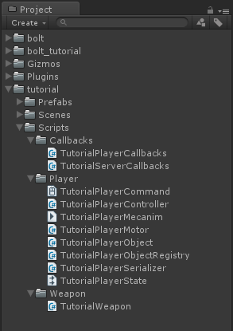
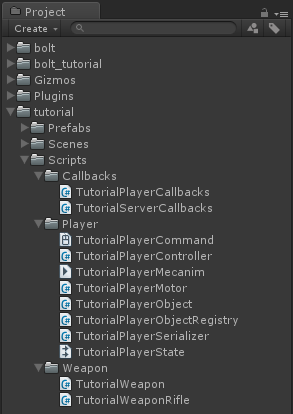
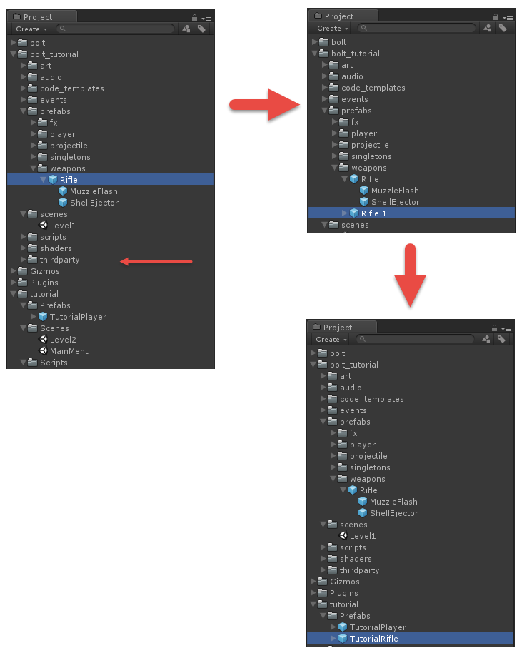
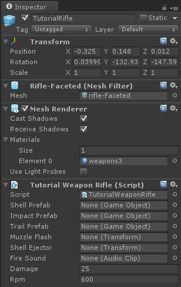
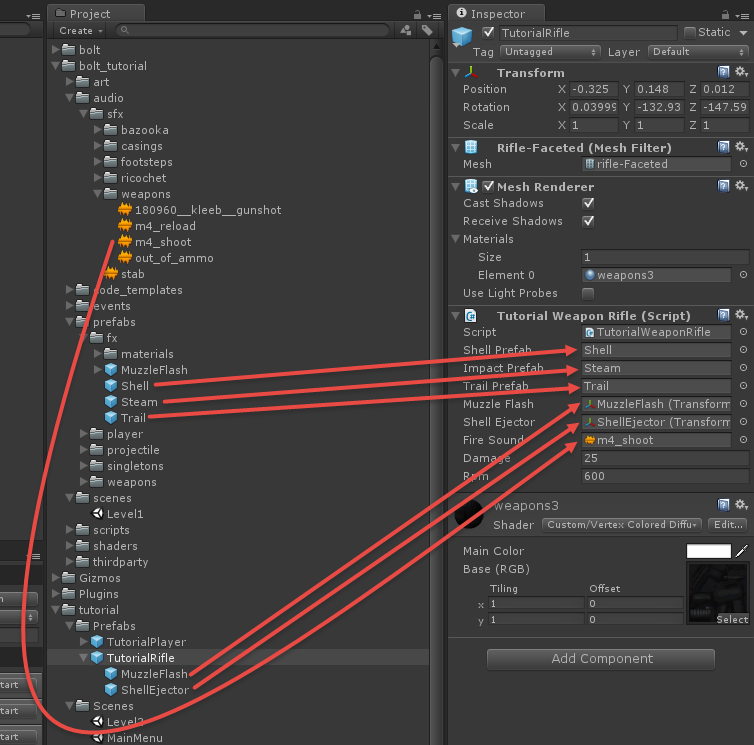
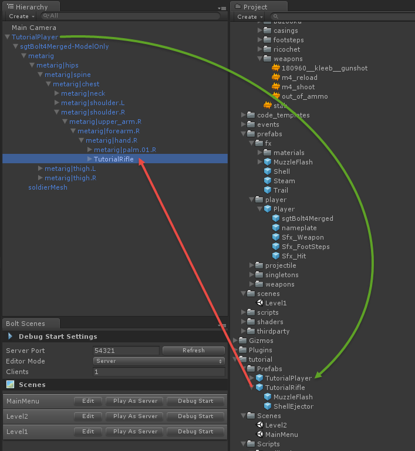
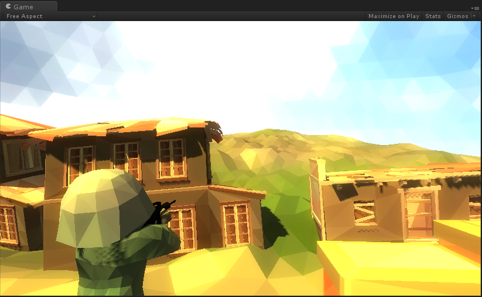
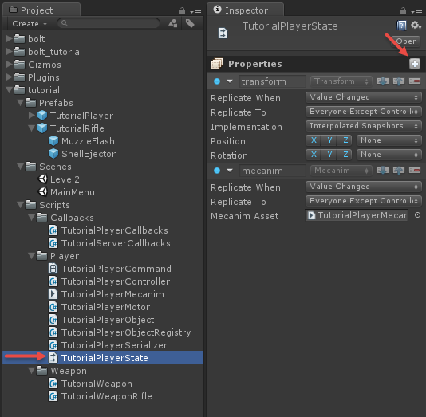
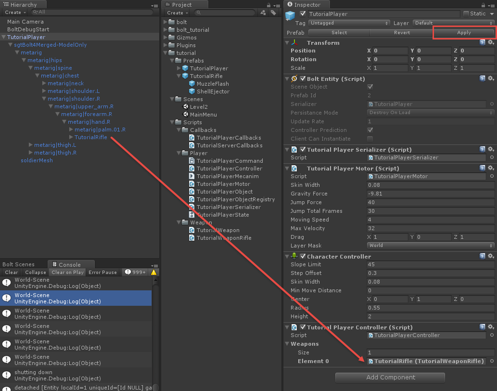
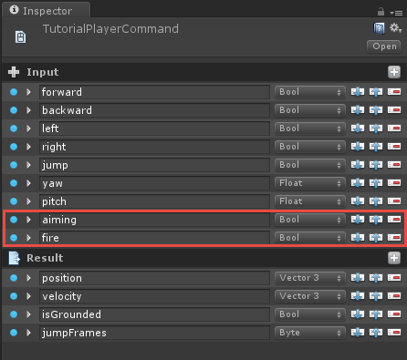

[<< Prev Chapter](chapter4.md)

## Authoritative Lag Compensated Shooting

The title is quite a mouthful, but so is what we are going to implement. The following chapters will handle one of those "holy grail" style things of network programming. We are going to demonstrate several key things.

1. Authoritative weapon switching
2. Authoritative shooting 
3. Lag compensation on clients

# Guns, guns and more guns!

The first thing we are going to do is to set up a little bit of a generic *Weapon* component, create a new folder called *Weapons* in *tutorial/Scripts* and inside that create a new C# script called *TutorialWeapon.cs*.



Inside this script we are going to put a pretty standard unity mono behaviour, which is just going to have some variables for configuring our weapon, as this is pretty much standard Unity stuff we will not go into more details on it here. We will end up using all of these variables during the tutorial, so they will all be explained individually.

```csharp
using UnityEngine;

public abstract class TutorialWeapon : MonoBehaviour {
  [SerializeField]
  public GameObject shellPrefab;

  [SerializeField]
  public GameObject impactPrefab;

  [SerializeField]
  public GameObject trailPrefab;

  [SerializeField]
  public Transform muzzleFlash;

  [SerializeField]
  public Transform shellEjector;

  [SerializeField]
  public AudioClip fireSound;

  [SerializeField]
  public byte damage = 25;

  [SerializeField]
  public int rpm = 600;

  public int fireIntervall {
    get {
      // calculate rounds per second
      int rps = (rpm / 60);

      // calculate frames between each round
      return BoltNetwork.framesPerSecond / rps;
    }
  }

  public int fireFrame {
    get;
    set;
  }

  public virtual void HitDetection(TutorialPlayerCommand cmd, BoltEntity entity) {

  }

  public virtual void DisplayEffects(BoltEntity entity) {

  }
}
```

The next thing we are going to do is to create one more script, right next to our *TutorialWeapon*, and call it *TutorialWeaponRifle*. 



For now this is going to be mostly empty and simply inherit from our *TutorialWeapon* class.

```csharp
using UnityEngine;
using System.Collections;

public class TutorialWeaponRifle : TutorialWeapon {

}
```

Go into the *bolt_tutorial/prefabs/weapons* folder and find the *Rifle* prefab, create a duplicate of it (CTRL+D on Windows, CMD+D on OS X). The duplicate will be called "Rifle 1", drag it into our *tutorial/Prefabs* folder and rename it to *TutorialRifle*.



Select our new *TutorialRifle* prefab and add our *TutorialWeaponRifle* script to it.



lets hook up all of the public variables on the *TutorialWeaponRifle* through the inspector, instead of trying to explain exactly what goes where, here's a picture on how to hook everything up properly.



Time to get our little soldier to hold his weapon. The rifle *should* be rotated properly and you should just have to drop your *TutorialRifle* prefab it under his right hand like below (red arrow), don't forget to save the *TutorialPlayer* prefab by either clicking *Apply* or dragging it back on-top itself in the *Project* window (green arrow).
 


If you play the game you should see the rifle in your characters hands, if it is rotated incorrectly go back to the *TutorialPlayer* prefab and re-adjust it. 
 


As you might have noticed it is not possible to pitch the camera, this is simply because we have made the *PlayerCamera* class we are working generic enough to work with the tutorial code in it's non-finished state. First we need to add a *pitch* property to our *TutorialPlayerState* asset.



Name the property "pitch", make sure the type is Float. Configure it accordingly.

1. **Replicate When** set to *Value Changed*
2. **Replicate To** set to *Everyone Except Controller*
3. **Interpolate** enabled 


Time to compile Bolt, click to *Assets/Compile Bolt Assets*. Let Bolt do it's magic and then open up the *TutorialPlayerController* script. We are going to update the `ExecuteCommand` method, inside the if-block protected by the `cmd.isFirstExecution` check we're going to add a line which copies the pitch from our command into our state. 

```csharp
// ... 

if (cmd.isFirstExecution) {
  AnimatePlayer(cmd);

  // set state pitch
  state.pitch = cmd.input.pitch;
}

// ... 
```  

We can then go to our *TutorialPlayerCallbacks* script, and updated the `ControlOfEntityGained` method so it looks like this.

```csharp
// ... 

public override void ControlOfEntityGained(BoltEntity arg) {
    // give the camera our players pitch
    PlayerCamera.instance.getPitch = () => arg.GetBoltState<ITutorialPlayerState>().pitch;

    // this tells the player camera to look at the entity we are controlling
    PlayerCamera.instance.SetTarget(arg);

    // add an audio listener for our character
    arg.gameObject.AddComponent<AudioListener>();
}

// ... 
``` 

The reason for this little roundabout way of getting the pitch into the camera is so that the camera can work without having all of the states compiled from the beginning, it allows us to progress in the tutorial in a more natural way.

We also add an `AudioListener` component to our entity game object so that we hear from the characters perspective. 

It's time to hook up our weapons and get to some shooting, first we need a way to find the weapons in *ExecuteCommand*, on the *TutorialPlayerController* script add a new inspector variable called *weapons* and have it be an array of TutorialWeapon objects, like this:

```csharp
// ...

public class TutorialPlayerController : BoltEntityBehaviour<ITutorialPlayerState> {
  const float MOUSE_SENSEITIVITY = 2f;

  TutorialPlayerMotor _motor;
  TutorialPlayerCommand.Input _input;

  [SerializeField]
  TutorialWeapon[] weapons;

// ...
```  

In the unity inspector drag the *TutorialRifle* object attached to the right hand of our character to the new *weapons* field on the *TutorialPlayerController*. Don't forget to apply your changes.



We need a couple of more pieces of input on our command so that we can properly communicate that we are firing our weapon. Open up the *TutorialPlayerCommand* and add a *aiming* and *fire* properties to the *Input* part, they should both be bools.



Compile Bolt again and open up our *TutorialPlayerController* script again, inside `PollKeys` we are going to query the state of our left and right mouse buttons.

```csharp
// ...

  void PollKeys(bool mouse) {
    _input.forward = Input.GetKey(KeyCode.W);
    _input.backward = Input.GetKey(KeyCode.S);
    _input.left = Input.GetKey(KeyCode.A);
    _input.right = Input.GetKey(KeyCode.D);
    _input.jump = Input.GetKeyDown(KeyCode.Space);

    // mouse buttons
    _input.fire = Input.GetMouseButton(0);
    _input.aiming = Input.GetMouseButton(1);

    if (mouse) {
      _input.yaw += (Input.GetAxisRaw("Mouse X") * MOUSE_SENSEITIVITY);
      _input.yaw %= 360f;

      _input.pitch += (-Input.GetAxisRaw("Mouse Y") * MOUSE_SENSEITIVITY);
      _input.pitch = Mathf.Clamp(_input.pitch, -85f, +85f);
    }
  }

// ...
```

Go to the `ExecuteCommand` function inside *TutorialPlayerController*. In `ExecuteCommand` right after we copy our pitch from the command input to the state property add a check to see if both aiming and fire are pressed down, and if they are call the `FireWeapon` function (which we are going to create).  

```csharp
  // ...

  public override void ExecuteCommand(BoltCommand c, bool resetState) {
    TutorialPlayerCommand cmd = (TutorialPlayerCommand)c;

    if (resetState) {
      // we got a correction from the server, reset (this only runs on the client)
      _motor.SetState(cmd.state);
    }
    else {
      // apply movement (this runs on both server and client)
      cmd.state = _motor.Move(cmd.input);

      if (cmd.isFirstExecution) {
        AnimatePlayer(cmd);

        // set state pitch
        state.pitch = cmd.input.pitch;

        // check if we should try to fire our weapon
        if (cmd.input.aiming && cmd.input.fire) {
          FireWeapon(cmd);
        }
      }
    }
  }

  // ...
```

Create a function called `FireWeapon` which takes a `TutorialPlayerCommand` class as its only argument.  

```csharp

  void FireWeapon(TutorialPlayerCommand cmd) {
    if (weapons[0].fireFrame + weapons[0].fireIntervall <= BoltNetwork.serverFrame) {
      weapons[0].fireFrame = BoltNetwork.serverFrame;

      state.mecanim.Fire();
    }
  }

```

Since we only have one weapon currently we just index straight into the weapons array, we check when we last fired plus how many frames that have to pass between each shot (fireIntervall is calculated from our RPM setting on the weapon), if enough frames have passed we set the .fireFrame property again, and call into the mecanim Fire() trigger.

The reason we are using mecanim triggers for communicating the fact that we have fired our weapon is that they are incredibly light weight, it will in fact only use two bits, and since we are firing quite often sending a comparatively large event is not worth it.

So, we need a way to hook into this mecanim trigger, fortunately Bolt lets you hook into mecanim and get a callback whenever a trigger is raised. Still inside of the *TutorialPlayerController* script, override the Bolt provided *Attached* method. 

```csharp
  // ...

  public override void Attached() {
    state.mecanim.onFire += () => {
      weapons[0].DisplayEffects(entity);
    };
  }

  // ...
```

We simply attach a C# lambda method to the `onFire` callback on the mecanim state and in that we call into the `DisplayEffects` method of our weapon. We are not quite done yet, but here is the completed *TutorialPlayerController* script for reference.

```csharp
using UnityEngine;

public class TutorialPlayerController : BoltEntityBehaviour<ITutorialPlayerState> {
  const float MOUSE_SENSEITIVITY = 2f;

  TutorialPlayerMotor _motor;
  TutorialPlayerCommand.Input _input;

  [SerializeField]
  TutorialWeapon[] weapons;

  void Awake() {
    _motor = GetComponent<TutorialPlayerMotor>();
  }

  void Update() {
    PollKeys(true);
  }

  void PollKeys(bool mouse) {
    _input.forward = Input.GetKey(KeyCode.W);
    _input.backward = Input.GetKey(KeyCode.S);
    _input.left = Input.GetKey(KeyCode.A);
    _input.right = Input.GetKey(KeyCode.D);
    _input.jump = Input.GetKeyDown(KeyCode.Space);

    // mouse buttons
    _input.fire = Input.GetMouseButton(0);
    _input.aiming = Input.GetMouseButton(1);

    if (mouse) {
      _input.yaw += (Input.GetAxisRaw("Mouse X") * MOUSE_SENSEITIVITY);
      _input.yaw %= 360f;

      _input.pitch += (-Input.GetAxisRaw("Mouse Y") * MOUSE_SENSEITIVITY);
      _input.pitch = Mathf.Clamp(_input.pitch, -85f, +85f);
    }
  }

  public override void Attached() {
    state.mecanim.onFire += () => {
      weapons[0].DisplayEffects(entity);
    };
  }

  public override void SimulateController() {
    PollKeys(false);

    TutorialPlayerCommand cmd;

    cmd = BoltFactory.NewCommand<TutorialPlayerCommand>();
    cmd.input = this._input;

    entity.QueueCommand(cmd);
  }

  public override void ExecuteCommand(BoltCommand c, bool resetState) {
    TutorialPlayerCommand cmd = (TutorialPlayerCommand)c;

    if (resetState) {
      // we got a correction from the server, reset (this only runs on the client)
      _motor.SetState(cmd.state);
    }
    else {
      // apply movement (this runs on both server and client)
      cmd.state = _motor.Move(cmd.input);

      if (cmd.isFirstExecution) {
        AnimatePlayer(cmd);

        // set state pitch
        state.pitch = cmd.input.pitch;

        // check if we should try to fire our weapon
        if (cmd.input.aiming && cmd.input.fire) {
          FireWeapon(cmd);
        }
      }
    }
  }

  void FireWeapon(TutorialPlayerCommand cmd) {
    if (weapons[0].fireFrame + weapons[0].fireIntervall <= BoltNetwork.serverFrame) {
      weapons[0].fireFrame = BoltNetwork.serverFrame;

      state.mecanim.Fire();
    }
  }

  void AnimatePlayer(TutorialPlayerCommand cmd) {
    // FWD <> BWD movement
    if (cmd.input.forward ^ cmd.input.backward) {
      state.mecanim.MoveZ = cmd.input.forward ? 1 : -1;
    }
    else {
      state.mecanim.MoveZ = 0;
    }

    // LEFT <> RIGHT movement
    if (cmd.input.left ^ cmd.input.right) {
      state.mecanim.MoveX = cmd.input.right ? 1 : -1;
    }
    else {
      state.mecanim.MoveX = 0;
    }

    // JUMP
    if (_motor.jumpStartedThisFrame) {
      state.mecanim.Jump();
    }
  }
}
```

The only thing left now is to implement the `DisplayEffects` function on our `TutorialRifle` script, this function is quite large, but there is nothing Bolt specific going on inside of it, as its just using plain Unity methods to show some fancy effects, etc.

```csharp
using UnityEngine;
using System.Collections;

public class TutorialWeaponRifle : TutorialWeapon {
  public override void DisplayEffects(BoltEntity entity) {
    // This calculates the current direction the player that is controlling the entity passed in is aiming.
    Vector3 pos;
    Vector3 fwd;
    Quaternion rot;

    // This lets us replicate camera conditions anywhere in code
    PlayerCamera.instance.CalculateCameraAimTransform(entity.transform, entity.GetBoltState<ITutorialPlayerState>().pitch, out pos, out rot);

    // Calculate forward vector of aiming camera 
    fwd = rot * Vector3.forward;

    RaycastHit rh;

    // Check to see if we hit anything (only for effects)
    if (Physics.Raycast(new Ray(pos, fwd), out rh)) {
      // if we have an impact prefab
      if (impactPrefab) {
        // and we did *not* hit another player, play our impact fx
        if (!rh.transform.GetComponent<BoltEntity>()) {
          GameObject.Instantiate(impactPrefab, rh.point, Quaternion.LookRotation(rh.normal));
        }
      }

      // if we have a trail prefab, use it!
      if (trailPrefab) {
        var trailGo = GameObject.Instantiate(trailPrefab, muzzleFlash.position, Quaternion.identity) as GameObject;
        var trail = trailGo.GetComponent<LineRenderer>();

        trail.SetPosition(0, muzzleFlash.position);
        trail.SetPosition(1, rh.point);
      }

    }

    // if we have a shell/casings prefab, eject it along the forward vector of our shell ejector
    if (shellPrefab) {
      GameObject go = (GameObject)GameObject.Instantiate(shellPrefab, shellEjector.position, shellEjector.rotation);
      go.rigidbody.AddRelativeForce(0, 0, 2, ForceMode.VelocityChange);
      go.rigidbody.AddTorque(new Vector3(Random.Range(-32f, +32f), Random.Range(-32f, +32f), Random.Range(-32f, +32f)), ForceMode.VelocityChange);
    }

    // if we have a muzzle flash, show it.
    if (muzzleFlash) {
      muzzleFlash.gameObject.SetActive(true);
    }

    // if we have an audio source AND we have a fire sound
    if (audio && fireSound) {
      audio.PlayOneShot(fireSound);
    }
  }
}
```

You should now be able to play as server and any number of clients and all firing and effects will replicate properly. 

[Next Chapter >>](chapter6.md)
